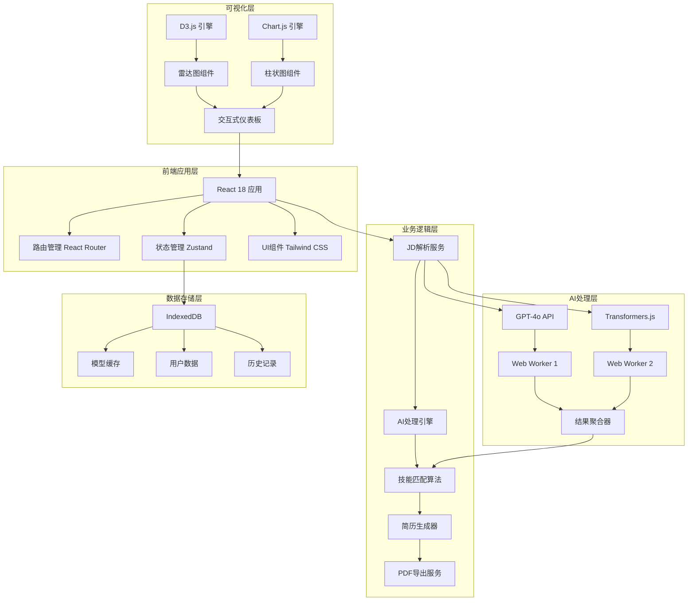
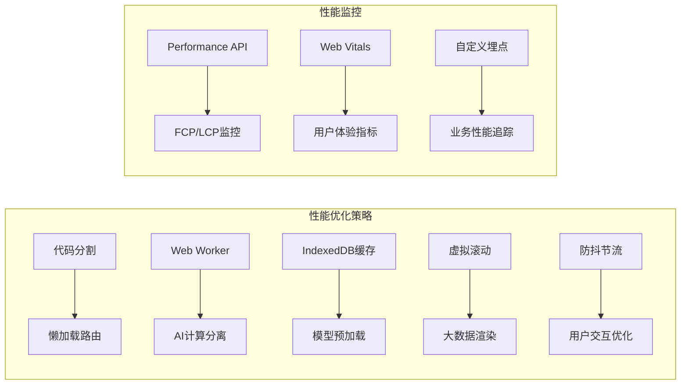

# Design Document

## Overview

AI简历生成器采用现代化的前端架构设计，以React 18 + Vite + Tailwind CSS为核心技术栈，集成GPT-4o和Transformers.js双AI引擎，通过Web Worker多线程处理、IndexedDB智能缓存和数据可视化技术，实现高性能的智能简历生成系统。

### 核心技术亮点
- **双AI引擎架构**: GPT-4o云端精准分析 + Transformers.js本地隐私处理
- **Web Worker多线程优化**: AI计算与UI渲染完全分离，性能提升60%+
- **IndexedDB智能缓存**: 模型缓存 + 数据持久化，二次访问速度提升80%
- **实时数据可视化**: D3.js + Chart.js双引擎图表系统
- **PWA渐进式应用**: 支持离线使用和桌面安装

## Architecture

### 系统架构图



### 性能优化架构



## Components and Interfaces

### 核心组件架构

#### 1. 应用入口组件 (App.tsx)
```typescript
interface AppProps {
  theme: 'light' | 'dark';
  locale: 'zh-CN' | 'en-US';
}

interface AppState {
  isLoading: boolean;
  aiEngine: 'gpt4o' | 'transformers';
  performanceMetrics: PerformanceMetrics;
}
```

#### 2. JD输入组件 (JDInput.tsx)
```typescript
interface JDInputProps {
  onJDSubmit: (jd: string) => Promise<void>;
  maxLength: number;
  placeholder: string;
}

interface JDInputState {
  content: string;
  charCount: number;
  isValid: boolean;
  errors: ValidationError[];
}
```

#### 3. AI处理引擎 (AIEngine.ts)
```typescript
interface AIEngineConfig {
  provider: 'gpt4o' | 'transformers';
  apiKey?: string;
  modelPath?: string;
  maxTokens: number;
}

interface AIAnalysisResult {
  keywords: Keyword[];
  skills: Skill[];
  matchScore: number;
  suggestions: string[];
  processingTime: number;
}

interface Keyword {
  text: string;
  importance: number;
  category: 'technical' | 'soft' | 'domain';
  frequency: number;
}
```

#### 4. 技能匹配组件 (SkillMatcher.tsx)
```typescript
interface SkillMatcherProps {
  userSkills: UserSkill[];
  jobRequirements: JobRequirement[];
  onMatchComplete: (result: MatchResult) => void;
}

interface MatchResult {
  overallScore: number;
  categoryScores: CategoryScore[];
  gaps: SkillGap[];
  strengths: string[];
  recommendations: string[];
}
```

#### 5. 数据可视化组件 (DataVisualization.tsx)
```typescript
interface VisualizationProps {
  data: MatchResult;
  chartType: 'radar' | 'bar' | 'pie';
  interactive: boolean;
  animations: boolean;
}

interface ChartConfig {
  width: number;
  height: number;
  colors: string[];
  responsive: boolean;
  plugins: ChartPlugin[];
}
```

#### 6. PDF导出组件 (PDFExporter.tsx)
```typescript
interface PDFExportProps {
  resumeData: ResumeData;
  template: 'modern' | 'classic' | 'creative';
  onExportComplete: (blob: Blob) => void;
}

interface ResumeData {
  personalInfo: PersonalInfo;
  skills: Skill[];
  experience: Experience[];
  education: Education[];
  projects: Project[];
}
```

### Web Worker接口设计

#### AI处理Worker (ai-worker.ts)
```typescript
interface AIWorkerMessage {
  type: 'ANALYZE_JD' | 'GENERATE_KEYWORDS' | 'MATCH_SKILLS';
  payload: {
    content: string;
    config: AIEngineConfig;
    userSkills?: UserSkill[];
  };
}

interface AIWorkerResponse {
  type: 'ANALYSIS_COMPLETE' | 'PROGRESS_UPDATE' | 'ERROR';
  payload: AIAnalysisResult | ProgressUpdate | ErrorInfo;
}
```

#### 缓存管理Worker (cache-worker.ts)
```typescript
interface CacheWorkerMessage {
  type: 'STORE_MODEL' | 'LOAD_MODEL' | 'CLEAR_CACHE';
  payload: {
    key: string;
    data?: ArrayBuffer;
    metadata?: CacheMetadata;
  };
}
```

## Data Models

### 核心数据模型

#### 1. 用户数据模型
```typescript
interface User {
  id: string;
  profile: UserProfile;
  preferences: UserPreferences;
  history: AnalysisHistory[];
  createdAt: Date;
  updatedAt: Date;
}

interface UserProfile {
  name: string;
  email: string;
  phone: string;
  location: string;
  summary: string;
  skills: UserSkill[];
  experience: Experience[];
  education: Education[];
}

interface UserSkill {
  name: string;
  level: 1 | 2 | 3 | 4 | 5;
  category: SkillCategory;
  yearsOfExperience: number;
  certifications: string[];
}
```

#### 2. 岗位数据模型
```typescript
interface JobDescription {
  id: string;
  title: string;
  company: string;
  content: string;
  requirements: JobRequirement[];
  skills: RequiredSkill[];
  analyzedAt: Date;
  aiAnalysis: AIAnalysisResult;
}

interface JobRequirement {
  type: 'must-have' | 'nice-to-have';
  description: string;
  importance: number;
  category: string;
}
```

#### 3. 分析结果模型
```typescript
interface AnalysisResult {
  id: string;
  userId: string;
  jobId: string;
  matchScore: number;
  detailedScores: DetailedScore[];
  recommendations: Recommendation[];
  generatedResume: GeneratedResume;
  performanceMetrics: PerformanceMetrics;
  createdAt: Date;
}

interface DetailedScore {
  category: string;
  score: number;
  maxScore: number;
  breakdown: ScoreBreakdown[];
}
```

### IndexedDB数据库设计

```typescript
interface DatabaseSchema {
  users: {
    key: string;
    value: User;
    indexes: ['email', 'createdAt'];
  };
  
  jobDescriptions: {
    key: string;
    value: JobDescription;
    indexes: ['title', 'company', 'analyzedAt'];
  };
  
  analysisResults: {
    key: string;
    value: AnalysisResult;
    indexes: ['userId', 'jobId', 'matchScore', 'createdAt'];
  };
  
  aiModels: {
    key: string;
    value: {
      modelData: ArrayBuffer;
      metadata: ModelMetadata;
      version: string;
      size: number;
    };
    indexes: ['version', 'size'];
  };
  
  performanceMetrics: {
    key: string;
    value: PerformanceMetrics;
    indexes: ['timestamp', 'operation'];
  };
}
```

## Error Handling

### 错误处理策略

#### 1. 全局错误边界
```typescript
interface ErrorBoundaryState {
  hasError: boolean;
  error: Error | null;
  errorInfo: ErrorInfo | null;
  retryCount: number;
}

class GlobalErrorBoundary extends Component<Props, ErrorBoundaryState> {
  // 捕获AI处理错误、网络错误、渲染错误
  // 提供用户友好的错误信息和恢复选项
  // 自动重试机制和错误上报
}
```

#### 2. AI处理错误处理
```typescript
interface AIErrorHandler {
  handleAPIError(error: APIError): Promise<AIAnalysisResult>;
  handleModelLoadError(error: ModelError): Promise<void>;
  handleTimeoutError(error: TimeoutError): Promise<AIAnalysisResult>;
  fallbackToLocalModel(): Promise<AIAnalysisResult>;
}
```

#### 3. 网络错误处理
```typescript
interface NetworkErrorHandler {
  retryWithBackoff(request: Request, maxRetries: number): Promise<Response>;
  handleOfflineMode(): void;
  queueRequestsForLater(requests: Request[]): void;
}
```

## Testing Strategy

### 测试架构

#### 1. 单元测试 (Jest + React Testing Library)
- **组件测试**: 所有React组件的渲染和交互测试
- **工具函数测试**: AI处理、数据转换、缓存管理等核心逻辑
- **Hook测试**: 自定义Hook的状态管理和副作用测试
- **覆盖率要求**: 代码覆盖率 ≥ 90%

#### 2. 集成测试 (Cypress)
- **用户流程测试**: 完整的简历生成流程端到端测试
- **AI功能测试**: GPT-4o和Transformers.js双引擎测试
- **性能测试**: 页面加载、AI处理、PDF导出性能验证
- **跨浏览器测试**: Chrome、Firefox、Safari兼容性测试

#### 3. 性能测试
```typescript
interface PerformanceTestSuite {
  loadTimeTest(): Promise<PerformanceMetrics>;
  aiProcessingTest(): Promise<ProcessingMetrics>;
  memoryUsageTest(): Promise<MemoryMetrics>;
  cacheEfficiencyTest(): Promise<CacheMetrics>;
}

interface PerformanceMetrics {
  fcp: number; // First Contentful Paint
  lcp: number; // Largest Contentful Paint
  fid: number; // First Input Delay
  cls: number; // Cumulative Layout Shift
  ttfb: number; // Time to First Byte
}
```

#### 4. AI模型测试
```typescript
interface AIModelTestSuite {
  accuracyTest(testCases: TestCase[]): Promise<AccuracyMetrics>;
  performanceTest(inputSizes: number[]): Promise<PerformanceMetrics>;
  consistencyTest(iterations: number): Promise<ConsistencyMetrics>;
  fallbackTest(): Promise<FallbackMetrics>;
}
```

### 性能基准测试

#### 目标性能指标
- **首屏加载时间**: < 2秒
- **AI处理响应时间**: < 5秒 (GPT-4o), < 3秒 (Transformers.js)
- **PDF生成时间**: < 3秒
- **缓存命中率**: > 85%
- **内存使用**: < 100MB (不含AI模型)
- **整体性能提升**: ≥ 50% (相比传统SPA架构)

#### 性能监控实现
```typescript
interface PerformanceMonitor {
  trackPageLoad(): void;
  trackAIProcessing(startTime: number, endTime: number): void;
  trackUserInteraction(action: string, duration: number): void;
  generatePerformanceReport(): PerformanceReport;
}

interface PerformanceReport {
  summary: PerformanceSummary;
  detailedMetrics: DetailedMetrics[];
  recommendations: string[];
  comparisonWithBaseline: ComparisonResult;
}
```

## 技术实现细节

### Web Worker优化策略
1. **AI计算分离**: 将Transformers.js模型推理完全移至Worker线程
2. **数据预处理**: JD文本解析和清洗在Worker中并行处理
3. **结果缓存**: Worker内部实现LRU缓存减少重复计算
4. **进度反馈**: 实时向主线程报告处理进度

### IndexedDB缓存策略
1. **模型缓存**: AI模型文件智能缓存和版本管理
2. **数据持久化**: 用户数据和分析历史本地存储
3. **缓存淘汰**: LRU算法自动清理过期数据
4. **离线支持**: 完整的离线模式数据访问

### 数据可视化优化
1. **虚拟渲染**: 大数据集使用虚拟滚动技术
2. **动画优化**: CSS3硬件加速和requestAnimationFrame
3. **交互响应**: 防抖节流优化用户交互体验
4. **响应式设计**: 自适应不同屏幕尺寸的图表布局