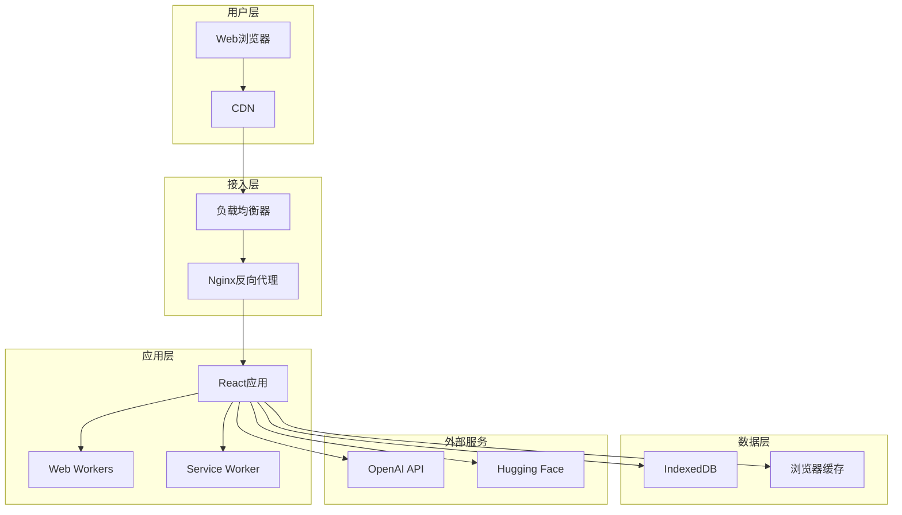
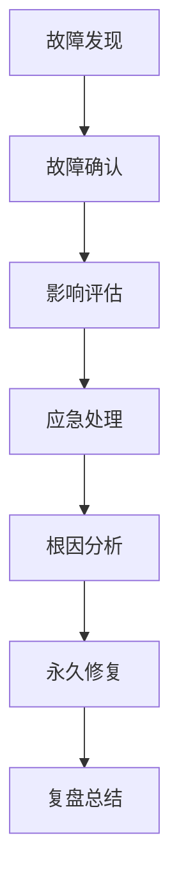

# AI简历生成器运维指南

## 概述

本文档提供AI简历生成器的日常运维指导，包括监控、维护、故障处理和性能优化等内容。

## 目录

- [系统架构](#系统架构)
- [监控体系](#监控体系)
- [日志管理](#日志管理)
- [性能监控](#性能监控)
- [故障处理](#故障处理)
- [备份恢复](#备份恢复)
- [安全管理](#安全管理)
- [容量规划](#容量规划)

## 系统架构

### 组件概览



### 关键指标

| 组件 | 关键指标 | 正常范围 | 告警阈值 |
|------|----------|----------|----------|
| 前端应用 | 首屏加载时间 | < 2s | > 3s |
| AI处理 | 响应时间 | < 5s | > 10s |
| 缓存命中率 | 命中率 | > 80% | < 70% |
| 内存使用 | 内存占用 | < 100MB | > 200MB |

## 监控体系

### 应用性能监控 (APM)

#### Web Vitals监控
```javascript
// 核心性能指标监控
const performanceMetrics = {
  FCP: 'First Contentful Paint',    // < 1.8s
  LCP: 'Largest Contentful Paint',  // < 2.5s
  FID: 'First Input Delay',         // < 100ms
  CLS: 'Cumulative Layout Shift',   // < 0.1
  TTFB: 'Time to First Byte'        // < 600ms
};
```

#### 自定义指标监控
```javascript
// 业务指标监控
const businessMetrics = {
  aiProcessingTime: 'AI处理时间',
  pdfGenerationTime: 'PDF生成时间',
  cacheHitRate: '缓存命中率',
  errorRate: '错误率',
  userEngagement: '用户参与度'
};
```

### 监控配置

#### Prometheus配置
```yaml
# prometheus.yml
global:
  scrape_interval: 15s

scrape_configs:
  - job_name: 'ai-resume-app'
    static_configs:
      - targets: ['localhost:3000']
    metrics_path: '/metrics'
    scrape_interval: 10s
```

#### Grafana仪表板
```json
{
  "dashboard": {
    "title": "AI简历生成器监控",
    "panels": [
      {
        "title": "响应时间",
        "type": "graph",
        "targets": [
          {
            "expr": "histogram_quantile(0.95, rate(http_request_duration_seconds_bucket[5m]))"
          }
        ]
      }
    ]
  }
}
```

### 告警规则

#### 性能告警
```yaml
# alerts.yml
groups:
  - name: performance
    rules:
      - alert: HighResponseTime
        expr: histogram_quantile(0.95, rate(http_request_duration_seconds_bucket[5m])) > 3
        for: 2m
        labels:
          severity: warning
        annotations:
          summary: "响应时间过高"
          description: "95%分位响应时间超过3秒"
      
      - alert: HighErrorRate
        expr: rate(http_requests_total{status=~"5.."}[5m]) > 0.1
        for: 1m
        labels:
          severity: critical
        annotations:
          summary: "错误率过高"
          description: "5xx错误率超过10%"
```

## 日志管理

### 日志分类

#### 应用日志
```javascript
// 日志级别
const LOG_LEVELS = {
  ERROR: 'error',    // 错误日志
  WARN: 'warn',      // 警告日志
  INFO: 'info',      // 信息日志
  DEBUG: 'debug'     // 调试日志
};

// 日志格式
const logFormat = {
  timestamp: '2024-01-01T12:00:00Z',
  level: 'info',
  message: '用户开始AI分析',
  userId: 'user123',
  sessionId: 'session456',
  traceId: 'trace789'
};
```

#### 访问日志
```nginx
# nginx访问日志格式
log_format main '$remote_addr - $remote_user [$time_local] "$request" '
                '$status $body_bytes_sent "$http_referer" '
                '"$http_user_agent" "$http_x_forwarded_for" '
                '$request_time $upstream_response_time';
```

### 日志收集

#### ELK Stack配置
```yaml
# logstash.conf
input {
  beats {
    port => 5044
  }
}

filter {
  if [fields][service] == "ai-resume" {
    json {
      source => "message"
    }
    
    date {
      match => [ "timestamp", "ISO8601" ]
    }
  }
}

output {
  elasticsearch {
    hosts => ["elasticsearch:9200"]
    index => "ai-resume-%{+YYYY.MM.dd}"
  }
}
```

### 日志分析

#### 常用查询
```elasticsearch
# 错误日志查询
GET ai-resume-*/_search
{
  "query": {
    "bool": {
      "must": [
        {"term": {"level": "error"}},
        {"range": {"timestamp": {"gte": "now-1h"}}}
      ]
    }
  }
}

# 性能分析查询
GET ai-resume-*/_search
{
  "aggs": {
    "avg_processing_time": {
      "avg": {
        "field": "processingTime"
      }
    }
  }
}
```

## 性能监控

### 前端性能监控

#### 关键指标
```javascript
// 性能监控实现
class PerformanceMonitor {
  constructor() {
    this.metrics = new Map();
    this.initWebVitals();
  }
  
  initWebVitals() {
    // FCP监控
    new PerformanceObserver((list) => {
      for (const entry of list.getEntries()) {
        if (entry.name === 'first-contentful-paint') {
          this.recordMetric('FCP', entry.startTime);
        }
      }
    }).observe({ entryTypes: ['paint'] });
    
    // LCP监控
    new PerformanceObserver((list) => {
      const entries = list.getEntries();
      const lastEntry = entries[entries.length - 1];
      this.recordMetric('LCP', lastEntry.startTime);
    }).observe({ entryTypes: ['largest-contentful-paint'] });
  }
  
  recordMetric(name, value) {
    this.metrics.set(name, value);
    this.sendToAnalytics(name, value);
  }
}
```

### 资源监控

#### 内存监控
```javascript
// 内存使用监控
function monitorMemoryUsage() {
  if (performance.memory) {
    const memory = {
      used: performance.memory.usedJSHeapSize,
      total: performance.memory.totalJSHeapSize,
      limit: performance.memory.jsHeapSizeLimit
    };
    
    // 内存使用率超过80%时告警
    const usageRate = memory.used / memory.limit;
    if (usageRate > 0.8) {
      console.warn('内存使用率过高:', usageRate);
    }
    
    return memory;
  }
}
```

#### 网络监控
```javascript
// 网络性能监控
function monitorNetworkPerformance() {
  const observer = new PerformanceObserver((list) => {
    for (const entry of list.getEntries()) {
      if (entry.initiatorType === 'fetch') {
        const metrics = {
          url: entry.name,
          duration: entry.duration,
          transferSize: entry.transferSize,
          responseStart: entry.responseStart
        };
        
        // 慢请求告警
        if (entry.duration > 5000) {
          console.warn('慢请求检测:', metrics);
        }
      }
    }
  });
  
  observer.observe({ entryTypes: ['resource'] });
}
```

## 故障处理

### 故障分类

#### 1. 应用故障
- **症状**: 页面无法加载、功能异常
- **排查**: 检查控制台错误、网络请求
- **处理**: 重启服务、回滚版本

#### 2. 性能故障
- **症状**: 响应缓慢、超时
- **排查**: 性能分析、资源监控
- **处理**: 优化代码、扩容资源

#### 3. 外部依赖故障
- **症状**: AI服务不可用
- **排查**: 检查API状态、网络连通性
- **处理**: 启用降级方案、切换服务

### 故障处理流程



### 应急预案

#### 服务降级
```javascript
// 服务降级配置
const degradationConfig = {
  aiService: {
    enabled: true,
    fallback: 'local',
    timeout: 10000
  },
  pdfGeneration: {
    enabled: true,
    fallback: 'simple',
    timeout: 5000
  }
};

// 降级实现
class ServiceDegradation {
  async processWithFallback(service, request) {
    try {
      return await service.process(request);
    } catch (error) {
      console.warn(`服务${service.name}降级:`, error);
      return await service.fallback(request);
    }
  }
}
```

#### 熔断机制
```javascript
// 熔断器实现
class CircuitBreaker {
  constructor(threshold = 5, timeout = 60000) {
    this.failureCount = 0;
    this.threshold = threshold;
    this.timeout = timeout;
    this.state = 'CLOSED'; // CLOSED, OPEN, HALF_OPEN
    this.nextAttempt = Date.now();
  }
  
  async call(fn) {
    if (this.state === 'OPEN') {
      if (Date.now() < this.nextAttempt) {
        throw new Error('熔断器开启');
      }
      this.state = 'HALF_OPEN';
    }
    
    try {
      const result = await fn();
      this.onSuccess();
      return result;
    } catch (error) {
      this.onFailure();
      throw error;
    }
  }
  
  onSuccess() {
    this.failureCount = 0;
    this.state = 'CLOSED';
  }
  
  onFailure() {
    this.failureCount++;
    if (this.failureCount >= this.threshold) {
      this.state = 'OPEN';
      this.nextAttempt = Date.now() + this.timeout;
    }
  }
}
```

## 备份恢复

### 数据备份

#### 用户数据备份
```javascript
// IndexedDB数据备份
class DataBackup {
  async backupUserData(userId) {
    const db = await this.openDatabase();
    const transaction = db.transaction(['users', 'analyses'], 'readonly');
    
    const userData = await transaction.objectStore('users').get(userId);
    const userAnalyses = await transaction.objectStore('analyses')
      .index('userId').getAll(userId);
    
    return {
      user: userData,
      analyses: userAnalyses,
      timestamp: new Date().toISOString()
    };
  }
  
  async restoreUserData(backupData) {
    const db = await this.openDatabase();
    const transaction = db.transaction(['users', 'analyses'], 'readwrite');
    
    await transaction.objectStore('users').put(backupData.user);
    
    for (const analysis of backupData.analyses) {
      await transaction.objectStore('analyses').put(analysis);
    }
    
    await transaction.complete;
  }
}
```

#### 配置备份
```bash
#!/bin/bash
# 配置备份脚本

BACKUP_DIR="/backup/ai-resume/$(date +%Y%m%d)"
mkdir -p "$BACKUP_DIR"

# 备份环境配置
cp .env.production "$BACKUP_DIR/"
cp .env.staging "$BACKUP_DIR/"

# 备份nginx配置
cp -r docker/ "$BACKUP_DIR/"

# 备份Kubernetes配置
cp -r k8s/ "$BACKUP_DIR/"

# 创建备份清单
echo "备份时间: $(date)" > "$BACKUP_DIR/backup.log"
echo "Git提交: $(git rev-parse HEAD)" >> "$BACKUP_DIR/backup.log"
```

### 恢复流程

#### 应用恢复
```bash
#!/bin/bash
# 应用恢复脚本

BACKUP_DATE=$1
BACKUP_DIR="/backup/ai-resume/$BACKUP_DATE"

if [ ! -d "$BACKUP_DIR" ]; then
    echo "备份目录不存在: $BACKUP_DIR"
    exit 1
fi

# 停止当前服务
docker-compose down

# 恢复配置文件
cp "$BACKUP_DIR/.env.production" .
cp -r "$BACKUP_DIR/docker/" .

# 重启服务
docker-compose up -d

echo "恢复完成"
```

## 安全管理

### 安全监控

#### 异常访问检测
```javascript
// 异常访问监控
class SecurityMonitor {
  constructor() {
    this.requestCounts = new Map();
    this.suspiciousIPs = new Set();
  }
  
  checkRequest(ip, userAgent) {
    // 频率限制检查
    const count = this.requestCounts.get(ip) || 0;
    if (count > 100) { // 每分钟超过100次请求
      this.suspiciousIPs.add(ip);
      return false;
    }
    
    this.requestCounts.set(ip, count + 1);
    
    // 用户代理检查
    if (this.isSuspiciousUserAgent(userAgent)) {
      this.suspiciousIPs.add(ip);
      return false;
    }
    
    return true;
  }
  
  isSuspiciousUserAgent(userAgent) {
    const suspiciousPatterns = [
      /bot/i,
      /crawler/i,
      /spider/i,
      /scraper/i
    ];
    
    return suspiciousPatterns.some(pattern => pattern.test(userAgent));
  }
}
```

### 安全配置

#### CSP策略
```nginx
# 内容安全策略
add_header Content-Security-Policy "
  default-src 'self';
  script-src 'self' 'unsafe-inline' 'unsafe-eval' https://api.openai.com;
  style-src 'self' 'unsafe-inline' https://fonts.googleapis.com;
  font-src 'self' https://fonts.gstatic.com;
  img-src 'self' data: https:;
  connect-src 'self' https://api.openai.com https://huggingface.co;
  worker-src 'self' blob:;
" always;
```

#### HTTPS配置
```nginx
# SSL配置
ssl_protocols TLSv1.2 TLSv1.3;
ssl_ciphers ECDHE-RSA-AES128-GCM-SHA256:ECDHE-RSA-AES256-GCM-SHA384;
ssl_prefer_server_ciphers off;

# HSTS
add_header Strict-Transport-Security "max-age=63072000" always;

# 其他安全头
add_header X-Frame-Options DENY always;
add_header X-Content-Type-Options nosniff always;
add_header X-XSS-Protection "1; mode=block" always;
```

## 容量规划

### 资源评估

#### 计算资源
```yaml
# 资源需求评估
resources:
  requests:
    memory: "128Mi"
    cpu: "100m"
  limits:
    memory: "256Mi"
    cpu: "200m"

# 扩容策略
autoscaling:
  minReplicas: 2
  maxReplicas: 10
  targetCPUUtilizationPercentage: 70
  targetMemoryUtilizationPercentage: 80
```

#### 存储容量
```javascript
// 存储容量监控
class StorageMonitor {
  async checkQuota() {
    if ('storage' in navigator && 'estimate' in navigator.storage) {
      const estimate = await navigator.storage.estimate();
      const usage = estimate.usage;
      const quota = estimate.quota;
      const usageRate = usage / quota;
      
      if (usageRate > 0.8) {
        console.warn('存储空间不足:', {
          usage: this.formatBytes(usage),
          quota: this.formatBytes(quota),
          rate: (usageRate * 100).toFixed(2) + '%'
        });
      }
      
      return { usage, quota, usageRate };
    }
  }
  
  formatBytes(bytes) {
    const sizes = ['Bytes', 'KB', 'MB', 'GB'];
    if (bytes === 0) return '0 Bytes';
    const i = Math.floor(Math.log(bytes) / Math.log(1024));
    return Math.round(bytes / Math.pow(1024, i) * 100) / 100 + ' ' + sizes[i];
  }
}
```

### 性能优化

#### 缓存优化
```javascript
// 缓存策略优化
class CacheOptimizer {
  constructor() {
    this.hitRates = new Map();
    this.accessPatterns = new Map();
  }
  
  recordAccess(key, hit) {
    // 记录命中率
    const stats = this.hitRates.get(key) || { hits: 0, misses: 0 };
    if (hit) {
      stats.hits++;
    } else {
      stats.misses++;
    }
    this.hitRates.set(key, stats);
    
    // 记录访问模式
    const pattern = this.accessPatterns.get(key) || [];
    pattern.push(Date.now());
    this.accessPatterns.set(key, pattern.slice(-100)); // 保留最近100次访问
  }
  
  getOptimizationSuggestions() {
    const suggestions = [];
    
    for (const [key, stats] of this.hitRates) {
      const hitRate = stats.hits / (stats.hits + stats.misses);
      
      if (hitRate < 0.5) {
        suggestions.push({
          key,
          issue: '命中率过低',
          suggestion: '考虑调整缓存策略或增加缓存时间'
        });
      }
    }
    
    return suggestions;
  }
}
```

---

## 运维检查清单

### 日常检查
- [ ] 应用健康状态
- [ ] 性能指标正常
- [ ] 错误日志检查
- [ ] 资源使用情况
- [ ] 安全告警检查

### 周期性维护
- [ ] 依赖包更新
- [ ] 安全补丁应用
- [ ] 性能优化评估
- [ ] 备份验证
- [ ] 容量规划评估

### 应急响应
- [ ] 故障响应流程
- [ ] 联系人信息更新
- [ ] 应急预案测试
- [ ] 恢复流程验证

---

## 联系信息

- **运维团队**: devops@ai-resume.com
- **技术支持**: tech-support@ai-resume.com
- **紧急联系**: emergency@ai-resume.com